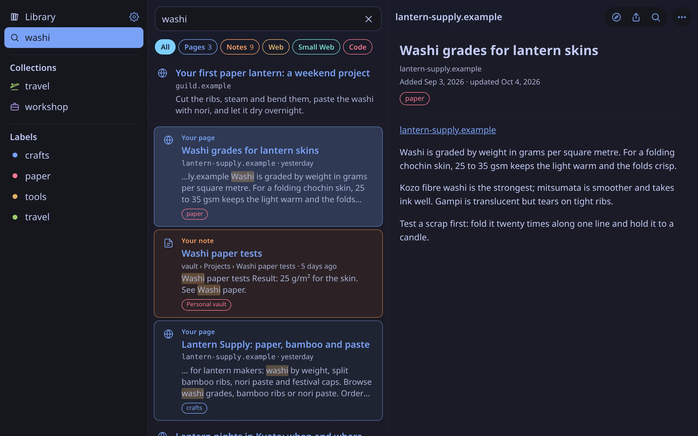
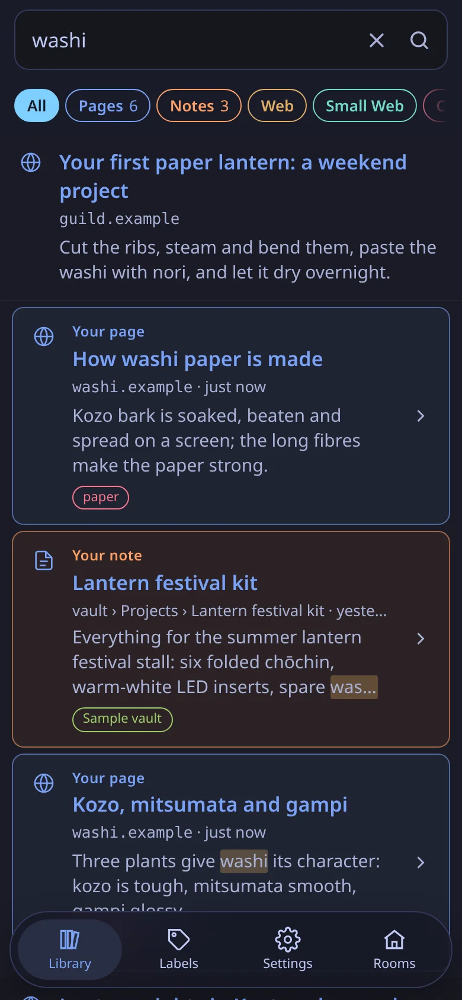
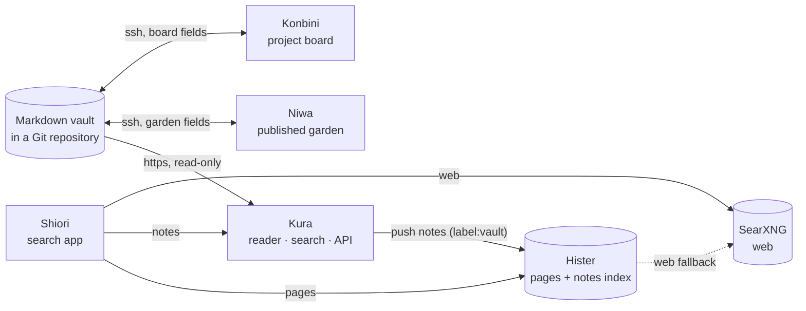

# Machiya


Machiya is a set of small self-hosted apps for finding what you've read: your pages (Hister), the web (SearXNG), your notes (an Obsidian vault in git) and your code.

A machiya (町家) is a Kyoto townhouse: a shop at the front, a small garden inside, a storehouse at the back, all under one roof.

<p align="center">
<a href="https://machiya-kobo.github.io/machiya/">Website</a> · <a href="#apps">Apps</a> · <a href="#architecture-diagram">Architecture Diagram</a> · <a href="#quickstart">Quickstart</a> · <a href="#try-it-with-the-sample-vault">Sample vault</a> · <a href="#use-your-own-vault">Your own vault</a> · <a href="#whats-in-this-repo">What's in this repo</a> · <a href="#status">Status</a> · <a href="#license">License</a>
</p>

<p align="center"><a href="site/img/hero-dark.webp"></a><br>Shiori: your pages, notes and the web in one search</p>

<table>
  <tr>
    <td align="center" width="33%"><a href="docs/screenshots/kura-home-light.png"></a><br>Kura: read your notes</td>
    <td align="center" width="33%"><a href="docs/screenshots/niwa-garden-dark.png"></a><br>Niwa: grow your digital garden</td>
    <td align="center" width="33%"><a href="docs/screenshots/konbini-board-light.png"></a><br>Konbini: manage your projects</td>
  </tr>
</table>

<p align="center"><a href="site/img/hero-phone-dark.webp"></a><br>Shiori on your phone</p>

Every screenshot uses the same invented vault: a paper-lantern workshop and a trip to Kyoto.

## Apps

| App | Meaning | What it does | Repo |
|---|---|---|---|
| **Shiori** | 栞<br>bookmark | Search everything: your pages, your notes, the web and your code. iPhone, iPad, Mac, Linux, Haiku and the web. | [machiya-kobo/shiori](https://github.com/machiya-kobo/shiori) |
| **Kura** | 蔵<br>storehouse | Read your notes, with full-text search and a JSON API. | [machiya-kobo/kura](https://github.com/machiya-kobo/kura) |
| **Niwa** | 庭<br>garden | Grow your digital garden on the Web, Gemini and Gopher. | [machiya-kobo/niwa](https://github.com/machiya-kobo/niwa) |
| **Konbini** | コンビニ<br>convenience store | Manage your projects on a board made from your notes. | [machiya-kobo/konbini](https://github.com/machiya-kobo/konbini) |

Powered by [Hister](https://github.com/asciimoo/hister) (every page you've read, plus your notes) and [SearXNG](https://github.com/searxng/searxng) (the web). Their reference config is in [config/](config/).

## Architecture Diagram

Each app runs on its own. They share one vault of Markdown notes in git, and an Obsidian vault works as is. More diagrams: [docs/architecture.md](docs/architecture.md).



## Quickstart

The whole stack on one machine, on your own vault. Everything listens on `127.0.0.1` only, so there's nothing to sign in to. You need `git` and Docker with Compose 2.20+, or Podman (`podman compose`).

```bash
mkdir machiya-stack && cd machiya-stack
for r in machiya kura niwa konbini; do git clone https://github.com/machiya-kobo/$r.git; done
cd machiya/compose
cp .env.example .env
mkdir -p data/kura data/niwa data/konbini data/hister   # yours, not root's: Docker would create missing ones as root
```

Edit `.env`:

| Setting | Set it to |
|---|---|
| `VAULT_REPO_URL`, `VAULT_GIT`, `VAULT_SUBDIR` | your vault as a bare git repository Niwa and Konbini can push to (`git clone --bare <your vault> /srv/machiya/vault.git`, in a folder you own: `sudo mkdir -p /srv/machiya && sudo chown "$USER" /srv/machiya`): `file:///srv/machiya/vault.git`, the same folder in `VAULT_GIT` (uncomment it), and the folder in it that holds the notes ([other URLs](#use-your-own-vault)) |
| `KONBINI_REPO` | a clone of the vault for the board to write to (`git clone <vault> /srv/machiya/konbini-repo`) |
| `SEARXNG_SECRET` | `openssl rand -hex 32` |
| `MACHIYA_UID`, `MACHIYA_GID` | `id -u`, `id -g` |

Start it. Profiles pick the apps; leave one out and the others carry on:

```bash
docker compose --profile engines --profile kura --profile niwa --profile konbini up -d --build --wait
```

| Kura | Niwa | Konbini | Hister | SearXNG |
|---|---|---|---|---|
| http://localhost:8083/ | http://localhost:8082/ | http://localhost:8081/ | http://localhost:4433/ | http://localhost:8888/ |

- **Run one app on its own:** each has its own Quickstart: [Kura](https://github.com/machiya-kobo/kura#quickstart), [Niwa](https://github.com/machiya-kobo/niwa#quickstart), [Konbini](https://github.com/machiya-kobo/konbini#quickstart), [Shiori](https://github.com/machiya-kobo/shiori#quickstart).
- **Try it on invented notes first:** [the sample vault](#try-it-with-the-sample-vault), set up by one script.
- **Search your code:** fill in the Code lines of `.env` (your Forgejo and GitHub owners; read-only tokens go in files under `secrets/`), run `mkdir -p data/code-import secrets`, and add `--profile code`. Shiori's Code view then shows your repos, READMEs, docs, issues, pull requests and releases ([stack/code-import](stack/code-import/README.md)).
- **Add people, agents or sign-in:** [docs/identity.md](docs/identity.md).

### Try it with the sample vault

The whole stack on the invented vault, in about ten minutes. [`tools/quickstart-test`](tools/quickstart-test) runs every block marked `quickstart:` on a fresh clone, so these are exactly the commands that were tested.

**You need:** `git`, `curl`, and a container engine with Compose: **Docker Engine 24+ with Compose 2.20+**, or rootless **Podman 4.9+** with the `docker-compose` plugin and its API socket on (`systemctl --user enable --now podman.socket`; then use `podman compose` wherever the commands say `docker compose`). Native on amd64 and arm64 (tested on Debian 13 arm64). About 2 GB of disk, and these ports free on `127.0.0.1`: 8081, 8082, 8083, 4433, 8888, 1965 and 7070 ([`compose/.env.example`](compose/.env.example) moves any of them).

**Debian and Ubuntu** (a clean machine has none of these): install them, then log out and back in so that your user is in the `docker` group (or run `newgrp docker`):

<!-- quickstart: packages-debian -->
```bash
sudo apt-get update
sudo apt-get install -y git curl docker.io docker-compose
sudo usermod -aG docker "$USER"
```

(Elsewhere: Docker's own packages for [your system](https://docs.docker.com/engine/install/), or Podman as above.)

**1. Get the code.** The stack builds its services from their own repositories, checked out side by side:

<!-- quickstart: clone -->
```bash
mkdir machiya-stack && cd machiya-stack
git clone https://github.com/machiya-kobo/machiya.git
git clone https://github.com/machiya-kobo/kura.git
git clone https://github.com/machiya-kobo/niwa.git
git clone https://github.com/machiya-kobo/konbini.git
```

**2. Set the demo up.** `demo-init` makes the sample vault a git repository, gives Konbini its own clone, and writes a `.env` for this machine: your user and group ids, a fresh SearXNG secret, no login (safe only because every port binds `127.0.0.1`), every app on.

<!-- quickstart: init -->
```bash
cd machiya/compose
./demo-init
```

**3. Start it.** The first start builds three images and pulls Hister, SearXNG and Valkey:

<!-- quickstart: up -->
```bash
docker compose up -d --build
```

**4. Check that it is up.** The loop waits (up to three minutes) for the services to start and the three rooms to read the vault:

<!-- quickstart: check -->
```bash
for i in $(seq 90); do
  curl -sf http://127.0.0.1:8083/api/status | grep -q '"ready": true' &&
  curl -sf http://127.0.0.1:8082/api/status | grep -q '"ready": true' &&
  curl -sf http://127.0.0.1:8081/healthz >/dev/null &&
  curl -sf http://127.0.0.1:4433/ >/dev/null &&
  curl -sf http://127.0.0.1:8888/healthz >/dev/null && break
  sleep 2
done
curl -s http://127.0.0.1:8083/api/status | grep -m1 -o '"notes": [0-9]*'
curl -s http://127.0.0.1:8082/api/status | grep -m1 -o '"published": [0-9]*'
curl -s http://127.0.0.1:8081/api/status | grep -m1 -o '"cards": [0-9]*'
curl -s -o /dev/null -w 'hister %{http_code}\n' http://127.0.0.1:4433/
curl -s http://127.0.0.1:8888/healthz; echo
for port in 8083 8082 8081; do curl -s http://127.0.0.1:$port/ | grep -o '<title>[^<]*'; done
```

You should see:

<!-- quickstart-expect: check -->
```text
"notes": 27
"published": 9
"cards": 10
hister 200
OK
<title>Kura
<title>Niwa
<title>Konbini
```

Open them in a browser (the **Rooms** menu in each header moves between them):

| | Address | What you see |
|---|---|---|
| **Kura** | http://localhost:8083/ | all 27 notes: folders, tags, backlinks, full-text search (try `bamboo`) |
| **Niwa** | http://localhost:8082/ | the garden: the 9 published notes, growth stages, and a gemini capsule on `gemini://localhost:1965/` |
| **Konbini** | http://localhost:8081/ | the board: 10 cards across every column, plus Review, Plan and Calendar |
| **Hister** | http://localhost:4433/ | the pages-and-notes index; Kura has pushed the notes into it (search `bamboo`) |
| **SearXNG** | http://localhost:8888/ | web search (it needs the internet to answer) |

**5. Watch a change travel.** Publishing a note in Niwa commits to the vault; Kura picks the commit up and shows the note as published:

<!-- quickstart: try -->
```bash
curl -s "http://127.0.0.1:8083/api/note?path=Notes/Candle%20vs%20LED.md" | grep -o '"published": [a-z]*'
curl -s -o /dev/null -X POST http://127.0.0.1:8082/publish -H "Origin: http://127.0.0.1:8082" \
  --data-urlencode "rel=Notes/Candle vs LED.md" -d on=1 -d confirm=1
for i in $(seq 90); do
  curl -s "http://127.0.0.1:8083/api/note?path=Notes/Candle%20vs%20LED.md" | grep -q '"published": true' && break
  sleep 3
done
curl -s "http://127.0.0.1:8083/api/note?path=Notes/Candle%20vs%20LED.md" | grep -o '"published": [a-z]*'
git -C data/vault.git log --format='%an: %s' -1
```

<!-- quickstart-expect: try -->
```text
"published": false
"published": true
garden: garden: 1 change (publish Candle vs LED)
```

(In the browser you would use Niwa's **Publish** button on a note's page; the command above is the same form post.)

**6. Stop it, or start over.** Your data is the `data/` folder next to `compose.yml`:

<!-- quickstart: stop -->
```bash
docker compose down -v
rm -rf data .env
```

### One shared copy of the vault

By default every app keeps its own copy of the vault. With `mirror.yml`, one `vault-mirror` service keeps a single clone: Kura reads it, and Niwa and Konbini borrow its git objects. That's how the stack runs for real, one flag away:

<!-- quickstart: mirror -->
```bash
./demo-init --mirror
docker compose up -d --build
for i in $(seq 90); do
  curl -sf http://127.0.0.1:8083/api/status | grep -q '"ready": true' &&
  curl -sf http://127.0.0.1:8082/api/status | grep -q '"ready": true' &&
  curl -sf http://127.0.0.1:8081/healthz >/dev/null && break
  sleep 2
done
docker compose exec -T niwa sh -c 'cat /data/repo/.git/objects/info/alternates' | sed 's#.*/data/#.../data/#'
docker compose down -v
rm -rf data .env
```

<!-- quickstart-expect: mirror -->
```text
.../data/mirror/vault/.git/objects
```

### Use your own vault

Copy `compose/.env.example` to `.env` (instead of running `demo-init`), make the `data/` folders as in the [Quickstart](#quickstart), and set:

- `VAULT_REPO_URL`: an https, ssh or `file://` URL. Niwa writes the garden's fields back, so it needs write access (an ssh deploy key); Kura only reads.
- `VAULT_SUBDIR`: the folder that holds the notes, if it isn't the repository's root.
- `KONBINI_REPO`: Konbini's own clone.

To reach the apps from other devices, put a proxy in front that sets `Tailscale-User-Login` (a Tailscale sidecar does, and adds TLS). Then switch `KURA_AUTH`, `NIWA_AUTH` and `KONBINI_AUTH` to `tailscale`, list your login in the `*_USERS`, and set the `*_BIND_BEHIND_PROXY=1` lines. People, agents, passwords or your own auth proxy: [docs/identity.md](docs/identity.md). Hister's users as the one sign-in needs [hister-login](docs/services/hister-login.md), which this compose doesn't run yet; the [dev stack](docs/dev-stack.md) has it wired up.

Without containers: [docs/install/](docs/install/) (Linux, FreeBSD, NetBSD, OpenBSD, one app at a time).

### The other half: Shiori

Shiori is the search app, not a service: iPhone, iPad, Mac, Linux, Haiku and the web. It talks to Hister, Kura, Konbini and SearXNG at the addresses above. Its [Quickstart](https://github.com/machiya-kobo/shiori#quickstart) builds the web and Linux apps against this stack.

## What's in this repo

- **[docs/](docs/)**: [architecture](docs/architecture.md), [principles](docs/principles.md), [voice](docs/voice.md), the [service docs](docs/services/), [API contracts](docs/contracts/), the [frontmatter schema](docs/frontmatter.md), the [design](docs/design.md) and its [shared UI](docs/ui.md), and [install guides](docs/install/).
- **[vaultkit/](vaultkit/)**: the shared vault core (frontmatter, notes, wikilinks, the Markdown renderer, a git mirror). Each app vendors it at a tag: [docs/vaultkit.md](docs/vaultkit.md).
- **[ui/](ui/)**: the web apps' shared stylesheet and script (themes, tab bar, Rooms menu, offline shell): [docs/ui.md](docs/ui.md).
- **[stack/](stack/)**: small services beside the apps:
  - `mcp/`: one MCP server for the board, notes, saved pages, labels, collections and the garden ([docs](docs/services/mcp.md))
  - `landing/`: the stack's front page and its `/status` page ([docs](docs/services/landing.md))
  - `hister-login/`: Hister's users as the one sign-in for every app ([docs](docs/services/hister-login.md))
  - `smallweb/`: Gemini and Gopher search for Shiori, and saving the pages Shiori asks for into Hister
  - `feed-import/`: what you read and star in a feed reader, into Hister
  - `code-import/`: your Forgejo and GitHub repos, into Hister for Shiori's Code view ([docs](docs/services/code-import.md))
  - `vault-mirror/`: one shared clone of the vault
- **[plugins/machiya/](plugins/machiya/)**: a Claude Code plugin: the MCP server plus skills for the backlog, the weekly review, recall, garden suggestions and tidying labels.
- **[compose/](compose/)**: the reference compose, and [compose/dev/](compose/dev/), the dev stack on synthetic data ([docs/dev-stack.md](docs/dev-stack.md)).
- **[config/](config/)**: reference config for Hister and SearXNG.
- **[sample-vault/](sample-vault/)**: the invented vault.

## Where it runs

Wherever you put it. Each app can be its own compose project, with its own Tailscale sidecar and `*.ts.net` name if you like. Start from [`compose/`](compose/) and [`config/`](config/).

## Status

Pre-1.0, so expect change. Each app runs on its own and keeps working when the others are down. The APIs are in [docs/contracts/](docs/contracts/) and the vault conventions in [docs/frontmatter.md](docs/frontmatter.md). Issues and pull requests are welcome; see each repository's `CONTRIBUTING.md`.

## License

Copyright (C) 2026 Micheal Waltz and Machiya contributors.

Machiya is free software: GNU Affero General Public License, version 3 or (at your option) any later version. See `LICENSE`. What the repository ships from other projects is listed in `THIRD_PARTY_NOTICES`.
