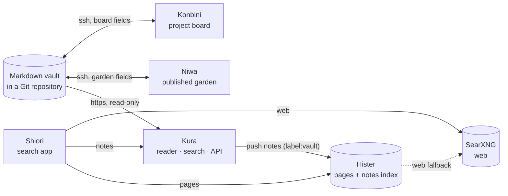

# Machiya


Machiya is a set of small self-hosted apps for finding what you've read: your pages ([Hister](https://github.com/asciimoo/hister)), the web ([SearXNG](https://github.com/searxng/searxng)), your notes ([Obsidian](https://obsidian.md)) and your code ([Forgejo](https://forgejo.org) or [GitHub](https://github.com)).

A machiya (町家) is a Kyoto townhouse: a shop at the front, a small garden inside, a storehouse at the back, all under one roof.

<p align="center">
<a href="https://machiya-kobo.github.io/">Website</a> · <a href="#apps">Apps</a> · <a href="#architecture-diagram">Architecture Diagram</a> · <a href="#quickstart">Quickstart</a> · <a href="docs/install/sample-vault.md">Sample vault</a> · <a href="#whats-in-this-repo">What's in this repo</a> · <a href="#status">Status</a> · <a href="#license">License</a>
</p>

<p align="center"><a href="site/img/hero-dark.webp"></a><br>Shiori: your pages, notes and the web in one search</p>

<table>
  <tr>
    <td align="center" width="33%"><a href="docs/screenshots/kura-home-light.png"></a><br>Kura: read your notes</td>
    <td align="center" width="33%"><a href="docs/screenshots/niwa-garden-dark.png"></a><br>Niwa: grow your digital garden</td>
    <td align="center" width="33%"><a href="docs/screenshots/konbini-board-light.png"></a><br>Konbini: manage your projects</td>
  </tr>
</table>

<p align="center"><a href="site/img/hero-phone-dark.webp"></a><br>Shiori on your phone</p>

Every screenshot uses the same invented vault: a paper-lantern workshop and a trip to Kyoto.

## Apps

| App | Meaning | What it does | Repo |
|---|---|---|---|
| **Shiori** | 栞<br>bookmark | Search everything: your pages, your notes, the web and your code. iPhone, iPad, Mac, Linux, Haiku, Classic Macintosh and the web. | [machiya-kobo/shiori](https://github.com/machiya-kobo/shiori) |
| **Kura** | 蔵<br>storehouse | Read your notes, with full-text search and a JSON API. | [machiya-kobo/kura](https://github.com/machiya-kobo/kura) |
| **Niwa** | 庭<br>garden | Grow your digital garden on the Web, Gemini and Gopher. | [machiya-kobo/niwa](https://github.com/machiya-kobo/niwa) |
| **Konbini** | コンビニ<br>convenience store | Manage your projects on a board made from your notes. | [machiya-kobo/konbini](https://github.com/machiya-kobo/konbini) |

Powered by [Hister](https://github.com/asciimoo/hister) (every page you've read, plus your notes) and [SearXNG](https://github.com/searxng/searxng) (the web). Their reference config is in [config/](config/).

## Architecture Diagram

Each app runs on its own. They share one vault of Markdown notes in git, and an Obsidian vault works as is. More diagrams: [docs/architecture.md](docs/architecture.md).



## Quickstart

Run the whole stack on one machine, on your own vault. It listens on `127.0.0.1` only, so there's nothing to sign in to. You need `git` and Docker with Compose 2.20+, or rootless Podman 4.9+ set up as in [the sample vault](docs/install/sample-vault.md#what-you-need).

**1. Get the code**

```bash
mkdir machiya-stack && cd machiya-stack
for r in machiya kura niwa konbini; do git clone https://github.com/machiya-kobo/$r.git; done
cd machiya/compose
cp .env.example .env
mkdir -p data/kura data/niwa data/konbini data/hister   # yours, not root's: Docker would create missing ones as root
```

**2. Give the apps your vault.** Niwa and Konbini write to it, so the stack keeps a copy they can push to:

```bash
sudo mkdir -p /srv/machiya && sudo chown "$USER" /srv/machiya
git clone --bare <your vault> /srv/machiya/vault.git
git clone /srv/machiya/vault.git /srv/machiya/konbini-repo
```

`/srv/machiya/vault.git` is now the stack's vault. Add it as a remote of your vault (`git remote add machiya <this machine>:/srv/machiya/vault.git`), push your edits to it, and pull the apps' edits from it.

**3. Fill in `.env`**

| Setting | Value |
|---|---|
| `VAULT_REPO_URL` | `file:///srv/machiya/vault.git` (https and ssh URLs work too; Niwa needs write access, Kura only reads) |
| `VAULT_GIT` | `/srv/machiya/vault.git` (uncomment it) |
| `VAULT_SUBDIR` | the folder that holds your notes, if it isn't the root (uncomment it) |
| `MACHIYA_USERNS`, `MACHIYA_NO_HEALTHCHECK` | rootless Podman only: `keep-id` and `true` |
| `KONBINI_REPO` | `/srv/machiya/konbini-repo` |
| `SEARXNG_SECRET` | the output of `openssl rand -hex 32` |
| `MACHIYA_UID`, `MACHIYA_GID` | the output of `id -u` and `id -g` |

**4. Start it.** `COMPOSE_PROFILES` in `.env` picks the apps; leave one out and the others carry on. With Podman, drop `--wait`:

```bash
docker compose up -d --build --wait
```

| App | Address |
|---|---|
| Kura | http://localhost:8083/ |
| Niwa | http://localhost:8082/ |
| Konbini | http://localhost:8081/ |
| Hister | http://localhost:4433/ |
| SearXNG | http://localhost:8888/ |

The **Rooms** menu in each app's header moves between them.

### Next

- **Try it on invented notes first:** [the sample vault](docs/install/sample-vault.md), about ten minutes.
- **Use it from your phone and laptop:** [remote access](docs/install/remote-access.md).
- **Search your code:** fill in the Code lines of `.env`, run `mkdir -p data/code-import secrets`, and add `code` to `COMPOSE_PROFILES` ([details](stack/code-import/README.md)).
- **Get the search app:** [build Shiori against this stack](https://github.com/machiya-kobo/shiori/blob/main/docs/quickstart.md#b-as-one-of-the-machiya-services), web and Linux.
- **Run one app, or skip containers:** [install guides](docs/install/) for Linux, the BSDs and one app at a time.

## What's in this repo

The docs, the shared vault library, the reference compose and config, a few small services and the sample vault: [the full list](docs/README.md#whats-in-this-repo).

## Status

Pre-1.0, so expect change. The APIs are in [docs/contracts/](docs/contracts/) and the vault conventions in [docs/frontmatter.md](docs/frontmatter.md). Issues and pull requests are welcome; see each repository's `CONTRIBUTING.md`.

## License

Copyright (C) 2026 Micheal Waltz and Machiya contributors.

Machiya is free software: GNU Affero General Public License, version 3 or (at your option) any later version. See `LICENSE`. What the repository ships from other projects is listed in `THIRD_PARTY_NOTICES`.
