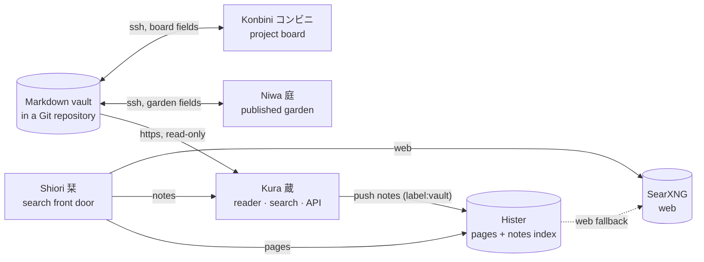
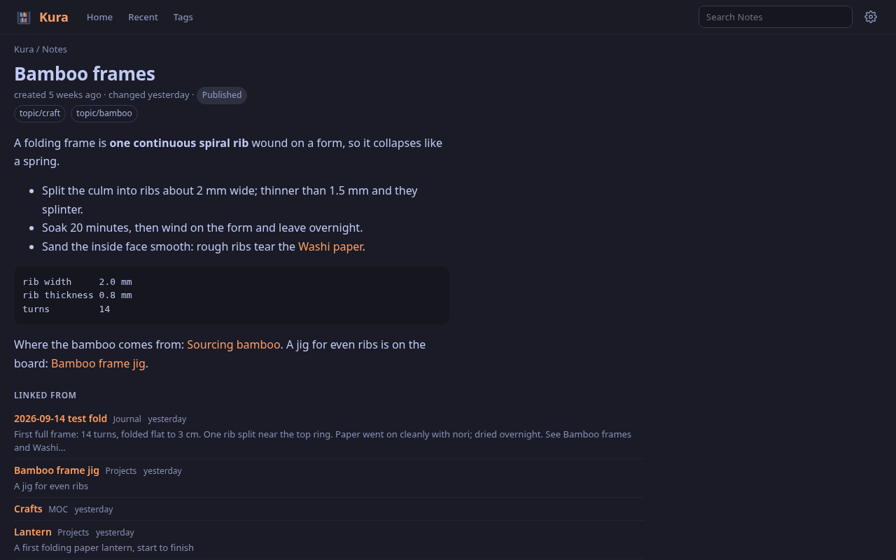
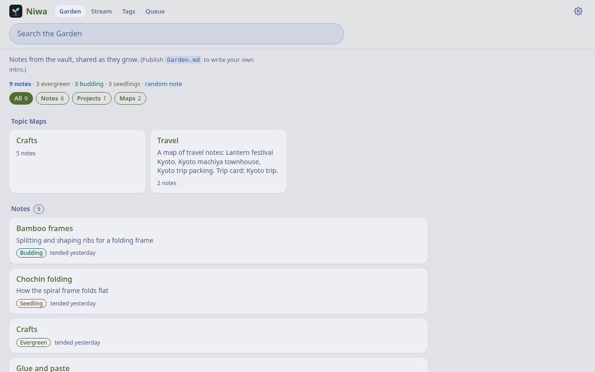
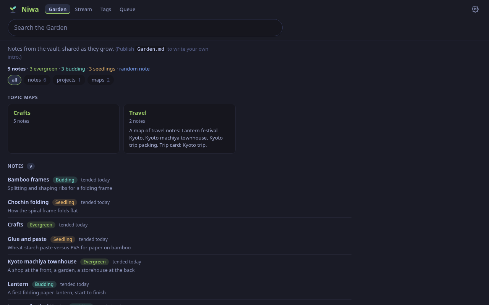
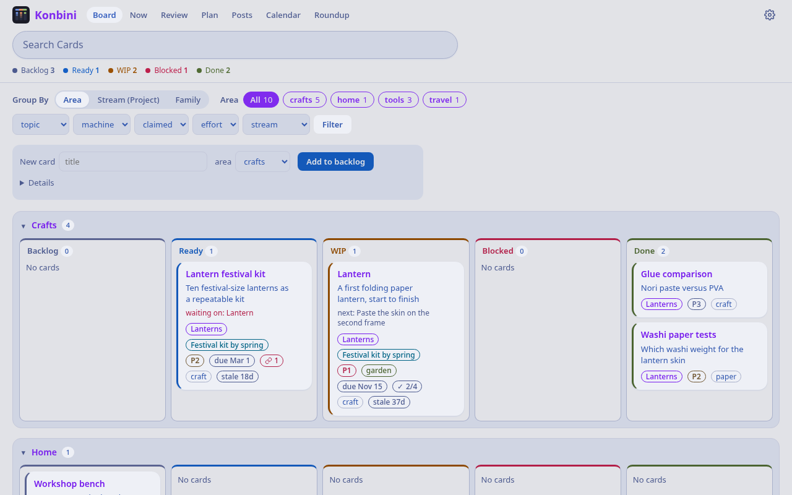
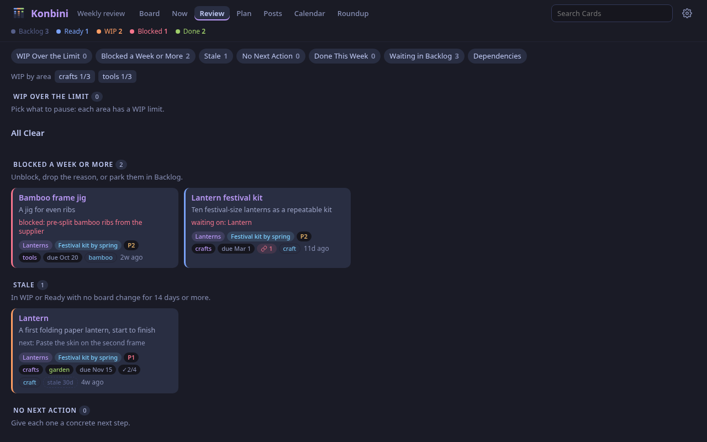
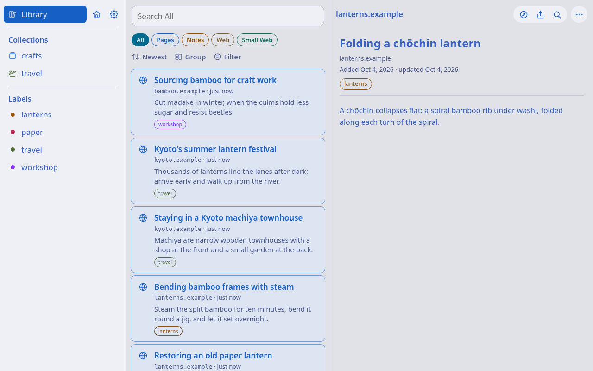

# Machiya 町家


A machiya is a Kyoto townhouse: a shop at the street front, a small inner garden, and a storehouse at the back, all under one roof. **Machiya** is the stack of standalone services built around one vault of Markdown notes in a Git repository (an Obsidian vault works as is):

| Service | | Job | Repo |
|---|---|---|---|
| **Kura** | 蔵 storehouse | every note: the reader, full-text search, a JSON API, and the push into Hister | [machiya-kobo/kura](https://github.com/machiya-kobo/kura) |
| **Niwa** | 庭 garden | the published garden: web, gemini, gopher, the publish buttons | [machiya-kobo/niwa](https://github.com/machiya-kobo/niwa) |
| **Konbini** | コンビニ shop | the project board built from the vault's project notes | [machiya-kobo/konbini](https://github.com/machiya-kobo/konbini) |
| **Shiori** | 栞 bookmark | the search front door (iPhone, iPad, Mac, Safari extension, web): your pages, your notes, the web | [machiya-kobo/shiori](https://github.com/machiya-kobo/shiori) |

Two services it builds on:

| Engine | Job | Here |
|---|---|---|
| **[Hister](https://github.com/asciimoo/hister)** | full-text index of every page you visited or saved (and, via Kura, your notes) | [config](config/hister/), [docs](docs/services/hister.md) |
| **[SearXNG](https://github.com/searxng/searxng)** | web search, engines optionally reached through a SOCKS proxy | [config](config/searxng/), [docs](docs/services/searxng.md) |



## What it looks like

The same invented vault in every app (a paper-lantern workshop and a trip to Kyoto), light and dark; click a picture for the full size. Each app's own README has more.

| | Light | Dark |
|---|---|---|
| **Kura** 蔵: every note, with backlinks and search | [](docs/screenshots/kura-home-light.png) | [](docs/screenshots/kura-note-dark.png) |
| **Niwa** 庭: the published garden | [](docs/screenshots/niwa-garden-light.png) | [](docs/screenshots/niwa-garden-dark.png) |
| **Konbini** コンビニ: the project board | [](docs/screenshots/konbini-board-light.png) | [](docs/screenshots/konbini-review-dark.png) |
| **Shiori** 栞: search across pages, notes and the web | [](docs/screenshots/shiori-library-light.png) | [](docs/screenshots/shiori-search-dark.png) |

## Quickstart

The whole stack on one machine, on your own vault, every room bound to `127.0.0.1` with nothing to sign in to. You need `git` and Docker with Compose 2.20+ (or Podman: `podman compose`).

```bash
mkdir machiya-stack && cd machiya-stack
for r in machiya kura niwa konbini; do git clone https://github.com/machiya-kobo/$r.git; done
cd machiya/compose
cp .env.example .env
mkdir -p data/kura data/niwa data/konbini data/hister   # yours, not root's: Docker would create missing ones as root
```

Edit `.env`:

| Setting | Set it to |
|---|---|
| `VAULT_REPO_URL`, `VAULT_GIT`, `VAULT_SUBDIR` | your vault as a bare git repository Niwa and Konbini can push to (`git clone --bare <your vault> /srv/machiya/vault.git`, in a folder you own: `sudo mkdir -p /srv/machiya && sudo chown "$USER" /srv/machiya`): `file:///srv/machiya/vault.git`, the same folder in `VAULT_GIT` (uncomment it), and the folder in it that holds the notes ([other URLs](#use-your-own-vault)) |
| `KONBINI_REPO` | a clone of the vault for the board to write to (`git clone <vault> /srv/machiya/konbini-repo`) |
| `SEARXNG_SECRET` | `openssl rand -hex 32` |
| `MACHIYA_UID`, `MACHIYA_GID` | `id -u`, `id -g` |

Start it, choosing the rooms with profiles (leave one out and the others carry on):

```bash
docker compose --profile engines --profile kura --profile niwa --profile konbini up -d --build --wait
```

| Kura 蔵 | Niwa 庭 | Konbini コンビニ | Hister | SearXNG |
|---|---|---|---|---|
| http://localhost:8083/ | http://localhost:8082/ | http://localhost:8081/ | http://localhost:4433/ | http://localhost:8888/ |

- **Run just one room:** each has its own Quickstart, no stack needed: [Kura](https://github.com/machiya-kobo/kura#quickstart), [Niwa](https://github.com/machiya-kobo/niwa#quickstart), [Konbini](https://github.com/machiya-kobo/konbini#quickstart), [Shiori](https://github.com/machiya-kobo/shiori#quickstart).
- **Try it first with a sample vault:** the walkthrough below sets everything up with one script.
- **Add people, agents or sign-in:** [docs/identity.md](docs/identity.md).

### Try it with the sample vault

The whole stack with a small invented vault (a paper-lantern workshop and a trip to Kyoto), in about ten minutes. Every block below marked `quickstart:` is run by [`tools/quickstart-test`](tools/quickstart-test) on a fresh clone, so these are exactly the commands that were tested.

**You need:** `git`, `curl`, and a container engine with Compose: **Docker Engine 24+ with Compose 2.20+**, or rootless **Podman 4.9+** with the `docker-compose` plugin and its API socket on (`systemctl --user enable --now podman.socket`; then use `podman compose` wherever the commands say `docker compose`). It runs on amd64 and arm64 (every image, the rooms' builds included, is native on both; tested on Debian 13 arm64). About 2 GB of disk for the images, and these ports free on `127.0.0.1`: 8081, 8082, 8083, 4433, 8888, 1965 and 7070 (the compose can move any of them: [`compose/.env.example`](compose/.env.example)).

**Debian and Ubuntu** (a clean machine has none of these): install them, then log out and back in so that your user is in the `docker` group (or run `newgrp docker`):

<!-- quickstart: packages-debian -->
```bash
sudo apt-get update
sudo apt-get install -y git curl docker.io docker-compose
sudo usermod -aG docker "$USER"
```

(Elsewhere: Docker's own packages for [your system](https://docs.docker.com/engine/install/), or Podman as above.)

**1. Get the code.** The stack builds its services from their own repositories, checked out side by side:

<!-- quickstart: clone -->
```bash
mkdir machiya-stack && cd machiya-stack
git clone https://github.com/machiya-kobo/machiya.git
git clone https://github.com/machiya-kobo/kura.git
git clone https://github.com/machiya-kobo/niwa.git
git clone https://github.com/machiya-kobo/konbini.git
```

**2. Set the demo up.** `demo-init` turns the sample vault into a git repository (the services clone it like any other vault), makes Konbini's own clone of it, and writes a `.env` for this machine: your user and group ids, a fresh SearXNG secret, open access on localhost (no login, so only because every port binds `127.0.0.1`), every service on.

<!-- quickstart: init -->
```bash
cd machiya/compose
./demo-init
```

**3. Start it.** The first start builds three images and pulls Hister, SearXNG and Valkey:

<!-- quickstart: up -->
```bash
docker compose up -d --build
```

**4. Check that it is up.** The loop waits (up to three minutes) for the services to start and the three rooms to read the vault:

<!-- quickstart: check -->
```bash
for i in $(seq 90); do
  curl -sf http://127.0.0.1:8083/api/status | grep -q '"ready": true' &&
  curl -sf http://127.0.0.1:8082/api/status | grep -q '"ready": true' &&
  curl -sf http://127.0.0.1:8081/healthz >/dev/null &&
  curl -sf http://127.0.0.1:4433/ >/dev/null &&
  curl -sf http://127.0.0.1:8888/healthz >/dev/null && break
  sleep 2
done
curl -s http://127.0.0.1:8083/api/status | grep -m1 -o '"notes": [0-9]*'
curl -s http://127.0.0.1:8082/api/status | grep -m1 -o '"published": [0-9]*'
curl -s http://127.0.0.1:8081/api/status | grep -m1 -o '"cards": [0-9]*'
curl -s -o /dev/null -w 'hister %{http_code}\n' http://127.0.0.1:4433/
curl -s http://127.0.0.1:8888/healthz; echo
for port in 8083 8082 8081; do curl -s http://127.0.0.1:$port/ | grep -o '<title>[^<]*'; done
```

You should see:

<!-- quickstart-expect: check -->
```text
"notes": 27
"published": 9
"cards": 10
hister 200
OK
<title>Kura
<title>Niwa
<title>Konbini
```

Open them in a browser (the header's **Rooms** menu moves between them):

| | Address | What you see |
|---|---|---|
| **Kura** 蔵 | http://localhost:8083/ | all 27 notes: folders, tags, backlinks, full-text search (try `bamboo`) |
| **Niwa** 庭 | http://localhost:8082/ | the garden: the 9 published notes, growth stages, and a gemini capsule on `gemini://localhost:1965/` |
| **Konbini** コンビニ | http://localhost:8081/ | the board: 10 cards across every column, plus Review, Plan and Calendar |
| **Hister** | http://localhost:4433/ | the pages-and-notes index; Kura has pushed the notes into it (search `bamboo`) |
| **SearXNG** | http://localhost:8888/ | web search (it needs the internet to answer) |

**5. Watch a change travel.** Publishing a note in Niwa commits to the vault; Kura picks the commit up and shows the note as published:

<!-- quickstart: try -->
```bash
curl -s "http://127.0.0.1:8083/api/note?path=Notes/Candle%20vs%20LED.md" | grep -o '"published": [a-z]*'
curl -s -o /dev/null -X POST http://127.0.0.1:8082/publish -H "Origin: http://127.0.0.1:8082" \
  --data-urlencode "rel=Notes/Candle vs LED.md" -d on=1 -d confirm=1
for i in $(seq 90); do
  curl -s "http://127.0.0.1:8083/api/note?path=Notes/Candle%20vs%20LED.md" | grep -q '"published": true' && break
  sleep 3
done
curl -s "http://127.0.0.1:8083/api/note?path=Notes/Candle%20vs%20LED.md" | grep -o '"published": [a-z]*'
git -C data/vault.git log --format='%an: %s' -1
```

<!-- quickstart-expect: try -->
```text
"published": false
"published": true
garden: garden: 1 change (publish Candle vs LED)
```

(In the browser you would use Niwa's **Publish** button on a note's page; the command above is the same form post.)

**6. Stop it, or start over.** Your data is the `data/` folder next to `compose.yml`:

<!-- quickstart: stop -->
```bash
docker compose down -v
rm -rf data .env
```

### One shared copy of the vault

By default every service keeps its own copy of the vault. Add `mirror.yml` and one extra service, `vault-mirror`, keeps a single clone that Kura reads and that Niwa and Konbini borrow git objects from (they keep only their own commits and check out only the notes folder). It is how the stack runs for real, and one flag away from the steps above:

<!-- quickstart: mirror -->
```bash
./demo-init --mirror
docker compose up -d --build
for i in $(seq 90); do
  curl -sf http://127.0.0.1:8083/api/status | grep -q '"ready": true' &&
  curl -sf http://127.0.0.1:8082/api/status | grep -q '"ready": true' &&
  curl -sf http://127.0.0.1:8081/healthz >/dev/null && break
  sleep 2
done
docker compose exec -T niwa sh -c 'cat /data/repo/.git/objects/info/alternates' | sed 's#.*/data/#.../data/#'
docker compose down -v
rm -rf data .env
```

<!-- quickstart-expect: mirror -->
```text
.../data/mirror/vault/.git/objects
```

### Use your own vault

Copy `compose/.env.example` to a file called `.env` beside it (instead of running `demo-init`), make the `data/` folders yourself as in the [Quickstart](#quickstart), and set `VAULT_REPO_URL` (an https, ssh or `file://` URL), `VAULT_SUBDIR` (the folder in the repository that holds the notes, if it is not the root), and Konbini's own clone in `KONBINI_REPO`. Niwa pushes the garden's fields back to the vault, so it needs write access (an ssh deploy key; Kura only reads). To reach the rooms from other devices, put a proxy that sets a `Tailscale-User-Login` header in front (a Tailscale sidecar does, and terminates TLS), switch `KURA_AUTH`, `NIWA_AUTH` and `KONBINI_AUTH` from `open` to `tailscale`, list your login in the `*_USERS`, and set the `*_BIND_BEHIND_PROXY=1` lines in `.env` (the rooms refuse a header mode on a non-loopback bind without them). Other ways in: people, agents, passwords or your own auth proxy (`*_AUTH=header`) from an identity file ([docs/identity.md](docs/identity.md)); the compose passes those settings through. Hister's users as the one sign-in (`*_AUTH=hister`, [hister-login](docs/services/hister-login.md)) needs the hister-login helper beside Hister, which this compose doesn't run yet; the [dev stack](docs/dev-stack.md) shows it wired up. The compose's header comments and the [service docs](docs/services/) cover the rest. Native installs (no containers): each room's own Quickstart (Debian or Ubuntu, other systems under its "More ways to run it"), and [docs/install/bsd.md](docs/install/bsd.md) for running them as services on FreeBSD, NetBSD and OpenBSD.

### The other half: Shiori

Shiori is a client, not a service: the search front door for iPhone, iPad, Mac, Linux and the web. It talks to Hister, Kura, Konbini and SearXNG at the addresses above. Its [Quickstart](https://github.com/machiya-kobo/shiori#quickstart) builds the web and Linux apps against this stack.

## What's in this repo

- **[docs/](docs/)** — how it fits together:
  - [architecture](docs/architecture.md): diagrams for components, data flow, identity and the network
  - [principles](docs/principles.md): what "standalone" means for every service
  - the [service docs](docs/services/) (the four services, the Hister and SearXNG engines, and the MCP server), their [API contracts](docs/contracts/), the [frontmatter schema](docs/frontmatter.md), the [design language](docs/design.md) and its [shared UI](docs/ui.md)
  - install guides ([docs/install/](docs/install/)) and the contracts between the services ([docs/contracts/](docs/contracts/))
- **[vaultkit/](vaultkit/)** — the shared vault core (frontmatter, notes, wikilink resolution, the Markdown renderer, a git mirror). Services vendor it at a tag; see [docs/vaultkit.md](docs/vaultkit.md).
- **[ui/](ui/)** — the shared stylesheet and script of the web rooms (themes, tab bar, rooms switcher, offline shell), vendored with vaultkit; see [docs/ui.md](docs/ui.md).
- **[stack/](stack/)** — small services that run beside the rooms:
  - `mcp/` (machiya-mcp, one MCP endpoint for the rooms: board, notes, page labels and collections, garden; pages themselves are read with Hister's own MCP; [docs/services/mcp.md](docs/services/mcp.md))
  - `landing/` (the stack's front door at `/` and its status page at `/status`: every app's state, version, sync freshness and recent deploys; [docs/services/landing.md](docs/services/landing.md))
  - `hister-login/` (Hister's users as the one sign-in for every room, `*_AUTH=hister`; [docs/services/hister-login.md](docs/services/hister-login.md))
  - `smallweb/` (Gemini and Gopher search for Shiori, and saving the pages Shiori asks for, http(s) ones too, to Hister)
  - `feed-import/` (what you read and star in a feed reader, into Hister) and `code-import/` (your Forgejo and GitHub repos, into Hister as Shiori's Code area; [docs/services/code-import.md](docs/services/code-import.md))
  - `vault-mirror/` (one shared clone of the vault for the readers)
- **[plugins/machiya/](plugins/machiya/)** — a Claude Code plugin: two MCP connections (machiya-mcp, and Hister's own MCP for searching and reading saved pages, with its history tool denied) and cross-room skills (backlog, weekly review, recall, garden suggestions, tidying saved-page labels).
- **[compose/](compose/)** — a reference compose file for the engines, Kura, Niwa and Konbini (Shiori is a client and not in it), and [compose/dev/](compose/dev/), the **dev stack**: every service with Hister's sign-in, on synthetic data only, in containers or as plain processes ([docs/dev-stack.md](docs/dev-stack.md)).
- **[config/](config/)** — reference configuration for Hister and SearXNG, as they run in this stack.
- **[sample-vault/](sample-vault/)** — a small demo vault, to run the stack without real notes.

## Where it runs

A deployment can run each service as its own stack (compose project), optionally with its own Tailscale sidecar and `*.ts.net` name, all owner-only. This repo is the product; a deployment is yours to make: start from [`compose/`](compose/) and [`config/`](config/).

## Status

Machiya is pre-1.0, so expect change. The services are standalone (each runs without the others; links between them are optional HTTP integrations that degrade gracefully), their APIs are documented in [docs/contracts/](docs/contracts/), and the vault conventions in [docs/frontmatter.md](docs/frontmatter.md). Issues and pull requests are welcome; see each repository's `CONTRIBUTING.md`.

## Licence

Copyright (C) 2026 Micheal Waltz and Machiya contributors.

Machiya is free software: GNU Affero General Public License, version 3 or (at your option) any later version. See `LICENSE`. What the repository ships from other projects is listed in `THIRD_PARTY_NOTICES`.
