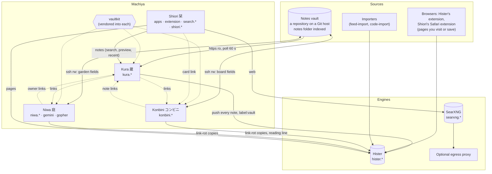
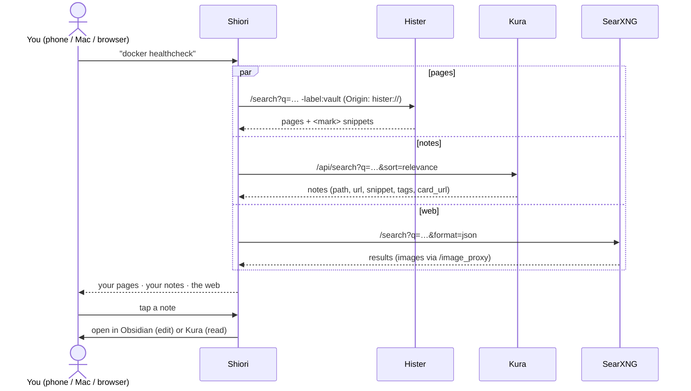
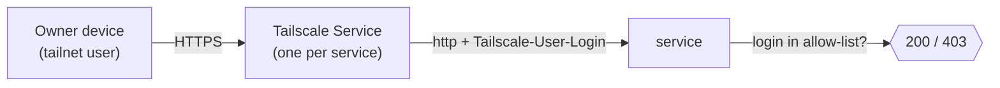
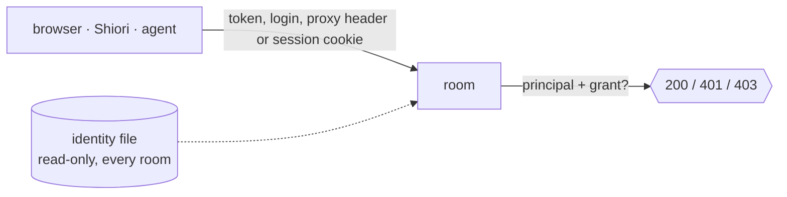
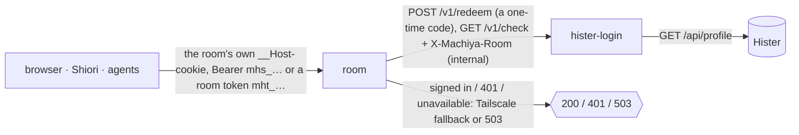
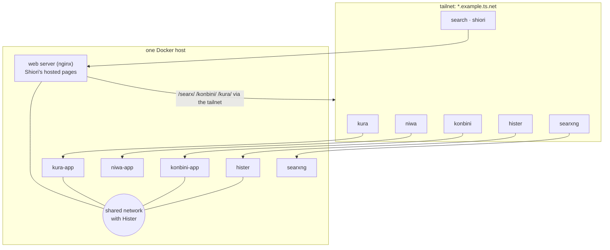

# Architecture

## Components

Solid arrows are data; dotted arrows are optional links (the service works without them).

## Who owns what

| Data | Owner | Readers |
|---|---|---|
| Note bodies | you, in Obsidian (on your devices, kept in sync by a sync tool or git) | everyone |
| Board frontmatter (`board`, `next`, `priority`, `rank`, `status/*`), stub notes, `.board/events` | Konbini | Kura (card links) |
| Garden frontmatter (`publish`, `growth`, `confidence`, `garden_pin`) | Niwa | Kura ("in the garden") |
| The full-text note index | Kura (rebuilt from git) | Shiori |
| `label:vault` documents in Hister | Kura (the push) | Hister's own UI and extension |
| Pages index | Hister | Shiori, Konbini, Niwa |

## A search in Shiori

## Identity

This is the default: one owner, no identity file. The optional **identity file** ([identity.md](identity.md)) changes only the last step. Each room reads the same read-only file and asks *who* (a token, a Tailscale login or tagged node, a trusted proxy's header, or the built-in sign-in's cookie) and then *what* (the principal's grants in this room): no proof is 401, no grant 403. Agents get tokens and only their grants; Kura cuts every answer to the vaults a principal may read, so work notes never reach an agent that isn't granted them. machiya-mcp checks its own callers against the file and calls the rooms as one principal, `mcp`.

**Or Hister's users** ([hister-login](services/hister-login.md), `*_AUTH=hister`): a room asks the helper beside Hister whether the caller is signed in to Hister, so one sign-in covers Hister and every room and a sign-out ends it everywhere.

- Every name is a **Tailscale Service** served by a tagged sidecar, one Service per room. Tailscale terminates TLS and adds `Tailscale-User-Login`.
- The **tailnet policy** grants these services to the owner only. Other users (for example a household) can be granted SearXNG only, and nothing else in Machiya.
- A service checks the header against its allow-list. Server-to-server calls in the example deployment either stay on a Docker network (Kura to Hister over a shared network, with no identity involved) or go out through the host's own tailscaled. The web server that hosts Shiori's pages works that way, so the call arrives as the owner's machine.
- Shiori's hosted pages reach the other services through same-origin routes on that web server (`/searx/`, `/konbini/`, `/kura/`), and never add or rewrite `Origin`. `/kura/` passes Kura's API only, never its reader pages ([Kura contract](contracts/kura-api.md#vaults)).

## Example deployment

One way to run it: each service is its own compose project, with the Tailscale Services in front.

The shared Hister network is an external Docker network created by the Hister stack. Services that talk to Hister (`http://hister:4433`) join it. That's deployment wiring: each service only sees a `HISTER_URL`.

**A service that believes `Tailscale-User-Login` never shares its listening network with strangers** (the owner's rule, 2026-10-05; sweep MACH-M-5, MACH-F-9). Any container on the same Docker network can send that header. So:

- machiya-mcp and smallweb each get a network of their own, shared only with their Tailscale sidecar. **Every member of that network has a pinned address**, the sidecar and the app alike: an app with a dynamic address can take the sidecar's address first when the stack restarts, and the sidecar then fails to start ("Address already in use"; a 3 h outage on 2026-10-05).
- They name that address in `MCP_TRUSTED_PROXIES` / `SMALLWEB_TRUSTED_PROXIES`, so the header counts only from the sidecar, even though each also joins Hister's network (and smallweb the proxy's) to make its own calls.
- In `tailscale` mode, a non-loopback bind without a trusted proxy (or `*_BIND_BEHIND_PROXY=1`) refuses to start.

The rooms do the same through vaultkit's `check_bind` (`
_BIND_BEHIND_PROXY`). The reference compose ([`compose/compose.yml`](../compose/compose.yml), profiles `smallweb` and `mcp`) shows the networks and the addresses: `smallweb` is 172.31.250.0/29 with the sidecar at .2 and smallweb at .3, and `machiya-mcp` is 172.31.250.8/29 with the sidecar at .10 and machiya-mcp at .11.

## Service summary

| | |
|---|---|
| Kura | standalone: its own stack and clone, FTS5 search, the API, the Hister push |
| Niwa | standalone: its own stack and read-write clone |
| Konbini | the board only; card pages link notes to Kura |
| Shiori | notes from Kura; pages from Hister with ` -label:vault` on every query |
| vaultkit | vendored into Kura, Niwa and Konbini |
| hister-login | optional, beside Hister: Hister's users as the one sign-in for the rooms (`*_AUTH=hister`) |
| landing | optional: the stack's front door (`/`) and status page (`/status`) |
| machiya-mcp | optional: one MCP endpoint for the rooms (board, notes, labels, garden suggestions) |
| smallweb | optional: Gemini and Gopher search for Shiori, and page saves into Hister |
| feed-import, code-import | optional: a feed reader's reads and stars, and your forges' repos, into Hister |
| vault-mirror | optional: one shared clone of the vault for the whole stack ([principles](principles.md), 2) |
