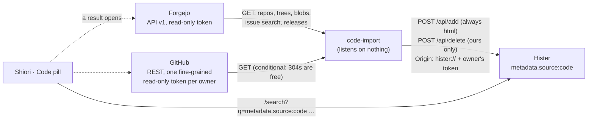

# code-import (the Code area's importer)

code-import copies the owner's repos on **Forgejo** and **GitHub** into [Hister](hister.md), where Shiori searches them as its **Code** area. A result opens the forge's own page. Code: [stack/code-import/](../../stack/code-import/) (settings, the metadata table and the tests are in its README).

**Status: phase 1 built (0.1.0), not deployed.** The Hister contract's [code documents](../contracts/hister.md#code-documents-metadatasourcecode) section is approved (the lead, 2026-10-04).

## What it imports (owner, 2026-10-05)

| | |
|---|---|
| **Hosts** | the self-hosted Forgejo and GitHub (Gitea works too: same API) |
| **Repos** | every repo the owner owns, except forks, archived repos and `obsidian`, `pass-store`, `backup`. A repo on both forges is indexed once: GitHub for `machiya-kobo`, Forgejo for `owner` (`CODE_IMPORT_TWINS`) |
| **Content** | repo cards (name, description, topics); READMEs and markdown docs on the default branch; issues and PRs (title, body, state; no comments); releases |
| **Not** | code bodies (phase 2, later, for repos the owner allow-lists), comments, wikis, commits |
| **AI** | on-device only, as for notes (below) |

## How it behaves

- **Every 15 minutes:**
  - it lists the repos;
  - it re-reads the docs and releases of repos that were pushed;
  - it fetches issues and PRs changed since its cursor: one search per owner on Forgejo, one conditional list per repo on GitHub.
- **Every 6 hours, a full run:** it re-reads everything, and withdraws what disappeared.
- **Each item is one Hister document** at its forge URL, with:
  - `metadata.source: code` and the `code_*` keys (the README's table);
  - **no label**;
  - `ignore_skip_rules`, because the skip rules refuse the tailnet's Forgejo.
- **Secrets.** Every document is sent **with `html`**, because Hister's 422 check reads only `html`. Before that, code-import's own, wider scan redacts likely secrets (or refuses the document, with `CODE_IMPORT_SECRETS=refuse`). Files named like secrets are never read, and `skip_sensitive_check` is never sent.
- **Browsed pages win.** A URL Hister already holds as somebody else's page (a GitHub issue the owner opened in the browser) is left alone. code-import replaces and deletes only documents whose `metadata.source` is `code`.
- **Withdrawals.** A deleted, renamed, transferred, archived or newly excluded repo has its documents withdrawn. So does a deleted doc or release, and (on a full run) a deleted issue.
- **Fail closed.** A forge that can't be listed, or suddenly lists nothing, stops the run before anything is withdrawn. So does Hister being down.
- **Logs** carry counts and URLs of refusals, never titles or text. `status.json` feeds the healthcheck.

## The Code area in Shiori (for the shiori agent)

- **The pill's query:** `metadata.source:code <words>`, searched as you type, with Hister's total as the count on the pill.
- **Filters** (each one a Hister term, ANDed):

  | Filter | Term |
  |---|---|
  | host | `metadata.code_host:forgejo\|github` |
  | kind | `metadata.code_kind:repo\|readme\|doc\|issue\|pr\|release`, or `metadata.code_kind:(issue\|pr)` |
  | state | `metadata.code_state:open` |
  | repo | `metadata.code_repo:<owner>__<repo>`. The key is lowercase, with every character other than a-z and 0-9 turned into `_`, and the owner and repo joined by `__`: `machiya-kobo/kura` → `machiya_kobo__kura`. A value with `/` or `-` can't be matched (tested on Hister v0.20.0; the README has the table) |
  | private | `metadata.code_private:true` |

- **Every other Hister query** adds ` -metadata.source:code`, next to the existing ` -label:vault -metadata.source:vault -type:local`: Pages, All, the counts, collections and the native twins (HisterKit, `search-core.js`, Linux).
- **Not in All**, like Files (until the owner says otherwise).
- **A row:**
  - a glyph for `code_kind`;
  - the title (Hister's);
  - chips: host, `code_repo_name`, `code_state`, a lock when `code_private` is `"true"`;
  - the date from `code_updated` (also the document's `added`);
  - Hister's snippet.
  It opens `url`, the forge's page. `code_twin_url` is the other forge's copy.
- **AI: on-device only, like notes** (the owner, 2026-10-05). A code result is private content:
  - Shiori's AI treats it as a note: a new `AIContent` case with on-device engines only;
  - `shiori-ai`'s server-side summarize refuses `metadata.source:code`, as it refuses `vault`.

## AI clients (Hister's MCP)

Hister's MCP `search` returns whatever the owner's token sees, code included. So the rule is the model's, as it is for notes, and nothing enforces it:
- page queries keep starting with `@pages`, which gains ` -metadata.source:code`;
- code results are never pulled into an AI's context.

The machiya plugin's skills and machiya-mcp's query suffix gain ` -metadata.source:code`. The `@code` alias exists for Hister's own UI, not for AI clients.

## Deploying it (for services, with the owner's OK)

- **Tokens, all read-only, in pass** (names only; the owner mints the GitHub ones, and the Forgejo one is his own account's):
  - `pass:hosts/server/code-import/forgejo-token`: a Forgejo token of the owner's account, scopes `read:repository`, `read:issue`, `read:user`, `read:organization`;
  - `pass:hosts/server/code-import/github-owner-token` and `pass:hosts/server/code-import/github-machiya-kobo-token`: fine-grained tokens, one per resource owner, with Metadata, Contents, Issues and Pull requests set to read, and an expiry. Never a classic token.
  - They are rendered to tmpfs files by `secrets.list`, like the others, plus the owner's Hister token (already there for feed-import).
- **Compose:** a `code-import` service in the hister stack, beside feed-import:
  - the pinned image, a non-root user, a small memory limit, a `/data` volume, no ports;
  - the Hister network;
  - egress to `forgejo.example.ts.net` (through the host's tailscaled) and `api.github.com`;
  - the environment:
    - `CODE_IMPORT_FORGEJO_URL=https://forgejo.example.ts.net`
    - `CODE_IMPORT_FORGEJO_OWNERS=owner,machiya`
    - `CODE_IMPORT_GITHUB_TOKEN_FILES=owner=…,machiya-kobo=…`
    - `CODE_IMPORT_TWINS=github:machiya-kobo=forgejo:machiya,forgejo:owner=github:owner`
    - `CODE_IMPORT_HISTER_URL=http://hister:4433`, `CODE_IMPORT_HISTER_TOKEN_FILE`
    - `CODE_IMPORT_PAUSE`: Hister's backup window, as feed-import has it.
- **Hister's aliases** (the owner's rules): add `@code` = `metadata.source:code`, and change `@pages` to `* -label:vault -metadata.source:vault -metadata.source:code`.
- **Monitoring:** a probe on `status.json`'s `ok`, like feed-import's.
- **First run:** a `--dry-run --limit 3` with the real tokens, then the service. The backfill is about 300 GitHub calls and a few hundred Forgejo calls, spaced 0.25 s and 0.5 s apart.
- **Privacy:** private repos' text lands in the owner's Hister, and so in its weekly export (backup-a, backup-b). The Forgejo repos are in those backups already; the GitHub-only private content is new there.

## Phase 2 (later)

Code bodies for repos the owner allow-lists, through the same importer:
- shallow clones and a file-type allow-list;
- the same secret scan and secret-name rule;
- deletions learnt from `git diff --name-status`;
- `code_kind: file` at the forge's `src/branch/…` or `blob/…` URL.
