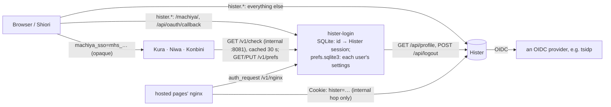

# hister-login: Hister's users as the one sign-in

[Hister](hister.md) has users of its own (`app.user_handling: true`, v0.20.0+), with a password sign-in and OIDC. hister-login makes a Hister sign-in count in every room: sign in once, in any room, in Shiori's hosted pages or in Hister itself, and every room knows you; sign out anywhere and every room forgets you within 30 seconds. Hister itself is not patched. Code: [stack/hister-login/](../../stack/hister-login/) (settings in its README); the rooms' side is vaultkit's `histerauth.py` (`<ROOM>_AUTH=hister`, [identity.md](../identity.md#hister-sign-in-authhister)).

It is optional. Without it a room keeps its Tailscale gate or the identity file, and a room in `hister` mode without the helper runs on its Tailscale identity alone.

## How it works



- **Where it runs:** beside Hister, on Hister's own host name. The proxy in front (Tailscale Serve, say) sends `/machiya/…` and the single path `/api/oauth/callback` to the helper's public port and everything else to Hister. Its internal port is reachable only from the rooms' network and is never routed by the proxy.
  With Tailscale Serve, a Proxy handler **strips its mount path** before forwarding, so the targets carry it back: `/machiya/` → `http://hister-login:8080/machiya/` and `/api/oauth/callback` → `http://hister-login:8080/api/oauth/callback`: without that the helper gets `/healthz` instead of `/machiya/healthz` and answers 404.
- **The cookie:** `machiya_sso=mhs_<32 random bytes>` on the shared domain (`MACHIYA_COOKIE_DOMAIN`, the same one the shared preferences use), `Secure; HttpOnly; SameSite=Lax`, at most 180 days. It is opaque: the helper keeps the mapping from it to the browser's Hister session. Hister's own `hister` cookie stays on Hister's host. `MACHIYA_SSO_COOKIE` renames it (letters, digits, `_`, `-`; the rooms and landing read the same setting, and the loop guard is `<name>_try`): a second stack under the same domain, such as a dev stack, uses its own name.
- **Sign-in:** a room without a session sends a page to `https://hister.example.ts.net/machiya/signin?return=<the page>`. If the browser is already signed in to Hister, the helper issues an id and sends it straight back. Otherwise its sign-in page offers Hister's password login (the page posts to Hister's own `/api/login`; the helper never sees the password) and, when configured, "Sign in with …" for Hister's OIDC provider. Hister has no "return to" of its own, so the helper's callback shim passes Hister's OAuth callback through unchanged and then sends the browser back where it started.
- **Checks:** a room asks `GET /v1/check` about an id or a Hister token; the helper asks Hister's `GET /api/profile` (at most once per credential every 30 s) and answers: signed in (`200 {username, user_id, via, kind}`), signed out (`401`; every id on that Hister session is dropped), or unavailable (`503 {"reason": "hister-unavailable" | "user-handling-off"}`).
- **Sign-out** ends everywhere: a room's `/signout`, the helper's `/machiya/signout` and its sessions page call Hister's logout and drop every id on that Hister session. A sign-out in Hister's own UI is noticed at the next check (within a minute). While Hister is down the ids are dropped at once and Hister's logout is retried.
- **Sessions page:** `/machiya/sessions` lists every browser and app signed in through the helper, with "Sign Out" for one and "Sign Out Everywhere". Hister tokens (extensions, scripts) are separate.
- **Apps:** Shiori's apps sign in to Hister themselves and trade their own Hister session for an id (`POST /machiya/api/app-session`), or open `/machiya/signin?app=1&return=shiori://signed-in` in an ephemeral web session and get `#sid=…&hister=…` back. The return is exactly `<scheme>://signed-in` (`HISTER_LOGIN_APP_SCHEMES`, default `shiori`). The flow finishes only on the app's own web session (`Sec-Fetch-Site: none`) or this page's own navigation (`same-origin`). Any other navigation, a link from another site for one, gets a confirmation page whose Continue is a same-origin `POST /machiya/signin`, and nothing is created until then (0.2.1). They send `Authorization: Bearer mhs_…` to the rooms.
- **Hosted pages** behind nginx use `auth_request` to `GET /v1/nginx`, which answers `X-Hister-Cookie: hister=<session>` for nginx's own hop to Hister. That location must replace the browser's `Cookie` header **and** have `proxy_hide_header Set-Cookie;`: Hister re-sends its session cookie on every signed-in answer, and without it the raw Hister session would reach the browser on the pages' host.
- **Automatic sign-in** (0.2.0, the owner's call of 2026-10-05). A room or landing with `MACHIYA_SIGNIN_PROVIDER=oidc` sends a page with no sign-in to `/machiya/signin?return=…&provider=oidc&auto=1`, and the helper goes straight to Hister's `/api/oauth?provider=oidc`. tsidp knows the device, so there is no page and no tap: each installed web app, with its own cookie jar, signs itself in.
  - The page shows instead when the browser holds `<sign-in cookie>_out` (`machiya_sso_out`). A deliberate sign-out sets it on the shared domain for 30 days: a room's `/signout`, `/machiya/signout`, or the sessions page signing this browser out.
  - The page also shows when the last round trip failed. A callback that doesn't finish a sign-in this helper started lands on the page with "Sign in with Tailscale didn't work. Try again, or sign in with your password." and sets the marker for 10 minutes, so it never loops.
  - The next successful sign-in clears the marker. `provider=` without `auto=1` (a tap on Shiori's "Sign In with Tailscale") always goes through.
- **The settings that follow a person** (0.2.0, [contracts/prefs.md](../contracts/prefs.md)) are kept in the helper, in their own file `prefs.sqlite3` beside the sessions file (`HISTER_LOGIN_PREFS_DB`). Each Hister user's settings are keyed by `hi:<sha256(username)[:32]>`, derived only from the credential the helper resolved itself.
  - **The rooms and landing** keep their same-origin `/api/prefs` and forward it to the internal `GET`/`PUT /v1/prefs` with the caller's own credential (`X-Machiya-Session` or `X-Access-Token`, exactly one, as for `/v1/check`).
  - **Shiori's apps, extensions and scripts** call the public `GET`/`PUT /machiya/api/prefs` with `Authorization: Bearer mhs_…` or a Hister token.
  - **The hosted pages** reach that same path through their own nginx with the sign-in cookie. A `PUT` then needs an `Origin` among the return hosts. There is no CORS.
  - **First render:** `/v1/check` carries the Shared values as `prefs`, so a room draws a fresh browser's first page in the person's theme.
  - **Values are never logged.**

## When something is down

| | A room with `<ROOM>_AUTH_FALLBACK=tailscale` | A room with `<ROOM>_AUTH_FALLBACK=none` |
|---|---|---|
| signed in, everything up | admitted | admitted |
| signed out (the helper or Hister said so) | sent to sign in; an API call gets 401 `{"error", "signin"}`; **never** the fallback | the same |
| the helper or Hister unreachable, a 5xx, or Hister's user handling off | the owner's Tailscale login (in `<ROOM>_USERS`) is admitted with a banner, "Signed in through the tailnet: sign-in is unavailable"; nothing cached; counted as `fallback_total` | **503** on pages and API; there is no grace period |

The helper's internal `/healthz` reports the helper **and** Hister (503 unless both are fine): a room uses it to know, before anyone has signed in, that sign-in is unavailable. The public `/machiya/healthz` is for probes: 200 while the helper itself works (Hister's state is in `"hister"`), 503 only when its own state fails, so a Hister outage alerts once, from Hister's `/health` probe.

## Run it

```sh
HISTER_LOGIN_PUBLIC_URL=https://hister.example.ts.net HISTER_LOGIN_HISTER_URL=http://hister:4433 \
  MACHIYA_COOKIE_DOMAIN=example.ts.net python3 stack/hister-login/hister_login.py
```

The image (`stack/hister-login/Dockerfile`) runs as uid 1000 with its state in `/data`:
- `hister-login.sqlite3` (0600, WAL): an id stored only as its SHA-256, the Hister session it maps to, the user, the times;
- `prefs.sqlite3` (0600): each user's settings.

Back both up together, with Hister's own database.

**Preferences on the command line** (run where the helper runs, e.g. `docker exec hister-login python3 /app/hister_login.py prefs …`):
- `prefs import --user NAME [--tailscale LOGIN] [--principal KEY] [--dry-run] FILE…` seeds an account from the rooms' old `prefs.sqlite3` files, which it opens read-only. For each key the newest `updated` across the files wins, and only when it is newer than the account's own, so a second run changes nothing.
- `prefs show --user NAME` lists what the account holds.
- `prefs delete --user NAME` forgets it (an account removed).

`stack/hister-login/dev/gate0.sh` brings up a throwaway stack (Hister with users and OIDC, the helper, three stand-in rooms, a stub OIDC provider, a TLS front for `*.machiya.test`), runs the Playwright checks in Chromium and WebKit, and removes it again.

Hister's side: `app.user_handling: true`, `app.public: false`, `server.base_url` = the public address, the OIDC provider under `server.oauth.oidc` with its client secret only in the environment (`HISTER__SERVER__OAUTH__OIDC__CLIENT_SECRET`), and `HISTER_CONFIG` set so Hister reads the file at all. Every one-off Hister CLI container needs that secret too once OIDC is configured. Bind the owner's OIDC identity (`users.o_auth_id = 'oidc-<email>'`) **before** the first OIDC sign-in: Hister has no account linking, and an unknown OIDC identity becomes a new, empty, non-admin account.
