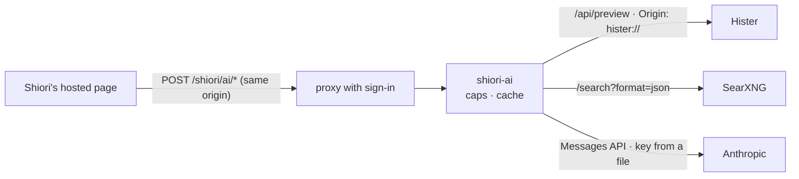

# shiori-ai

Summarize a saved page, or answer a web search, from Shiori on the web. shiori-ai is the server side of **Summarize** and **AI Answer** on Shiori's hosted pages. It asks Claude through the Anthropic API, only when you ask, within daily caps.

- **Code:** [stack/shiori-ai/](../../stack/shiori-ai/). Its README has the settings, every error and the tests.
- **Status:** 0.1.0. In daily use since 2026-09-29 as a script; published as a component in 0.1.0.
- **Not for the apps.** Shiori's apps run their AI on the device or with your own key; they don't call this.

## What it does

| | Summarize | AI Answer |
|---|---|---|
| **Call** | `POST /shiori/ai/summarize {url, refresh}` | `POST /shiori/ai/answer {q, refresh}` |
| **Reads** | Hister's stored copy of the page (`/api/preview`) | SearXNG's first 8 web results: titles and snippets only |
| **Never** | fetches the page; sends a note or code | fetches a page; takes Hister syntax (`label:`, `url:`, `metadata.`) |
| **Answers** | a sentence and two to four points | two sentences and up to three points, citing `[1]`, `[2]` |
| **Cache** | per page and capture | 24 hours per search |

`GET /shiori/ai/status` says whether it's on and how many calls are left today; `/healthz` is the probe. Neither has a gate.

## Your notes stay home

- A page on a note host (`SHIORI_AI_NOTE_HOSTS`: `kura`, `konbini`, `niwa`) is refused before Hister is even asked.
- A page labeled `vault`, or with `metadata.source` `vault` or `code`, is refused after.
- The log has counts: never a URL, a search, a title or text.

## Who may use it

The same gate as [shiori-feed](shiori-feed.md) (`SHIORI_AI_AUTH`: `tailscale`, `proxy` or `open`), then a same-origin check: only Shiori's own page may post. The caps (`SHIORI_AI_DAILY_REQUESTS`, 100; `SHIORI_AI_DAILY_INPUT_TOKENS`, 2,000,000; both per UTC day) and a per-minute limit bound the bill.

## Deploying it

- **Compose:** the `shiori` profile in the reference compose ([compose/compose.yml](../../compose/compose.yml)).
- **By hand:** the image built from `stack/shiori-ai/`, a non-root user, a read-only root, 128 MB, a `/data` volume, on Hister's network, with egress to `api.anthropic.com`, and:
  - `SHIORI_AI_KEY_FILE`: an Anthropic key of its own, with a spend limit, in a tmpfs file;
  - `SHIORI_AI_HISTER_URL`, `SHIORI_AI_HISTER_TOKEN_FILE`, `SHIORI_AI_SEARXNG_URL` (the `json` format on);
  - the gate's settings.
- **Routes:** on the web server that serves Shiori's pages, `/shiori/ai/` to shiori-ai behind its sign-in, with `Host` set to the page's own host. `/shiori/ai/status` and `/shiori/ai/healthz` may skip the sign-in. When shiori-ai is down, answer JSON 503 there: never fall through to Hister.
- **Shiori's build:** `SHIORI_AI=1`, so the pages offer it.
- **Monitoring:** probe `/healthz`. The [landing page](landing.md) shows "AI on · N left today" from `status`.
