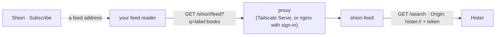

# shiori-feed

Subscribe to any Hister search in your feed reader. Shiori's **Subscribe** gives you a feed address for a search, a label or a collection (all your collections at once as OPML), and shiori-feed answers it with the newest matching pages in [Hister](hister.md).

- **Code:** [stack/shiori-feed/](../../stack/shiori-feed/). Its README has the settings, the endpoint's limits and the tests.
- **Status:** 0.1.0. In daily use since 2026-09-28 as a script; published as a component in 0.1.0.

## What it does

| | |
|---|---|
| **Asks** | Hister's `/search`, sort `date`, 50 results with their text, `Origin: hister://` and your token |
| **Answers** | `GET /shiori/feed?q=<query>[&title=…][&exclude_label=…]` → RSS 2.0, cached 5 minutes |
| **Leaves out** | code documents always; the labels you name (Shiori names `vault`) |
| **Keeps** | nothing: no state, no database |
| **Probe** | `GET /shiori/healthz`, no gate |

## Who may read it

Your feeds are your browsing history, so shiori-feed has a gate of its own (`SHIORI_FEED_AUTH`):
- **`tailscale`** (default): the logins in `SHIORI_FEED_USERS`, from the proxy's addresses in `SHIORI_FEED_TRUSTED_PROXIES`;
- **`proxy`**: only the proxy at `SHIORI_FEED_TRUSTED_PROXIES` may connect, and it signs people in (nginx with `auth_request` to [hister-login](hister-login.md));
- **`open`**: `127.0.0.1` only, or a container whose port is published on the host's `127.0.0.1` (`SHIORI_FEED_BIND_BEHIND_PROXY=1`).

A setting that would let anyone in stops the start. A feed reader on the open internet can't reach your feeds.

**Room tokens** (0.2.0), for agents and scripts, as [smallweb](../contracts/smallweb-api.md) takes them: set `SHIORI_FEED_AUTH_URL` to [hister-login](hister-login.md)'s address, `SHIORI_FEED_PUBLIC_URL` to the address the tokens are issued for and `SHIORI_FEED_HISTER_USERS` to the Hister users a token may act as (never `*`). Then, in `tailscale` or `proxy` mode, a caller may send `Authorization: Bearer mht_…` (or `X-Machiya-Token`). hister-login confirms each token; a request with one is decided by the token alone, and a bad or another room's token is refused.

## Deploying it

- **Compose:** the `shiori` profile in the reference compose ([compose/compose.yml](../../compose/compose.yml)).
- **By hand:** the image built from `stack/shiori-feed/` on Hister's network, a non-root user, a read-only root, 64 MB, and:
  - `SHIORI_FEED_HISTER_URL=http://hister:4433`, `SHIORI_FEED_HISTER_TOKEN_FILE` (a tmpfs file, never the environment);
  - `SHIORI_FEED_HISTER_PUBLIC_URL`: Hister's address for browsers (the channel's link);
  - the gate's settings, above.
- **Routes:** Shiori's apps build feed addresses on the Hister host, and its hosted pages on their own host. Route `/shiori/` to shiori-feed on both, ahead of Hister.
- **Monitoring:** probe `/shiori/healthz` (alive) or `/shiori/api/status` (`ok` turns false once three feeds in a row failed to reach Hister). `/shiori/api/changelog` serves this service's CHANGELOG. Neither needs a login. The [landing page](landing.md) shows "feed ok" from them.
